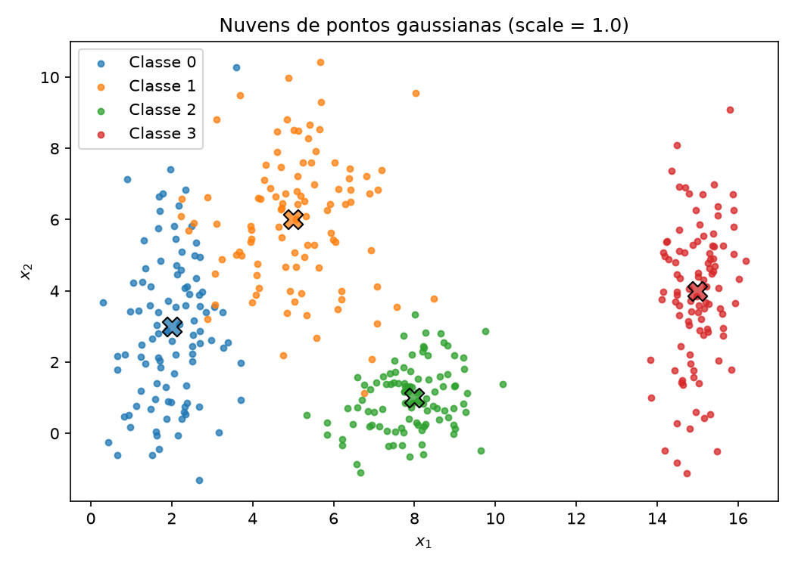
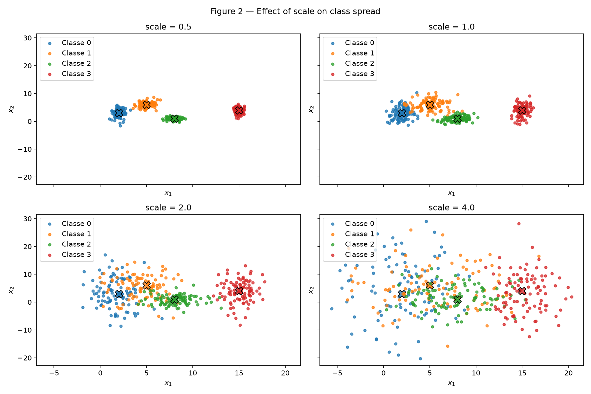
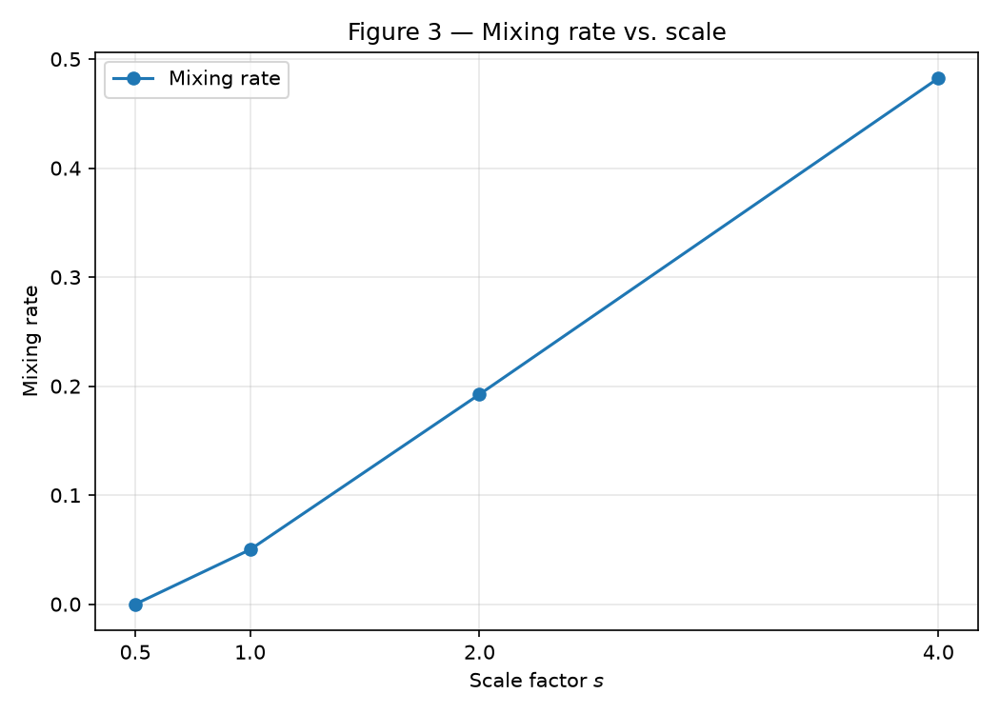
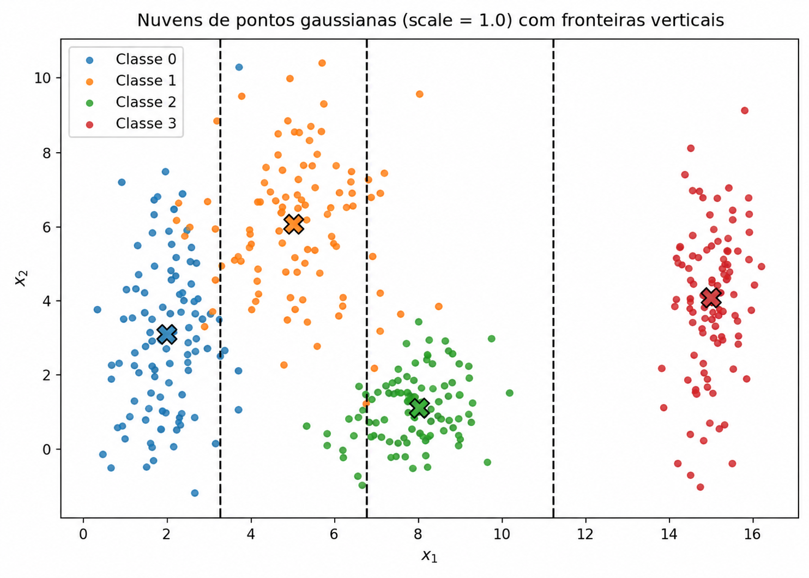
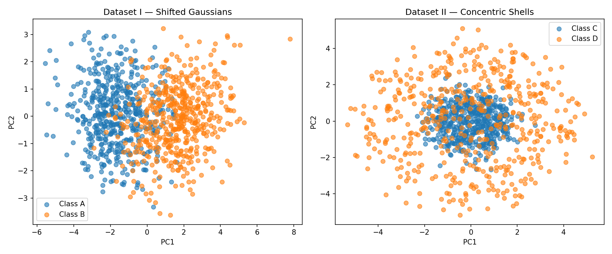
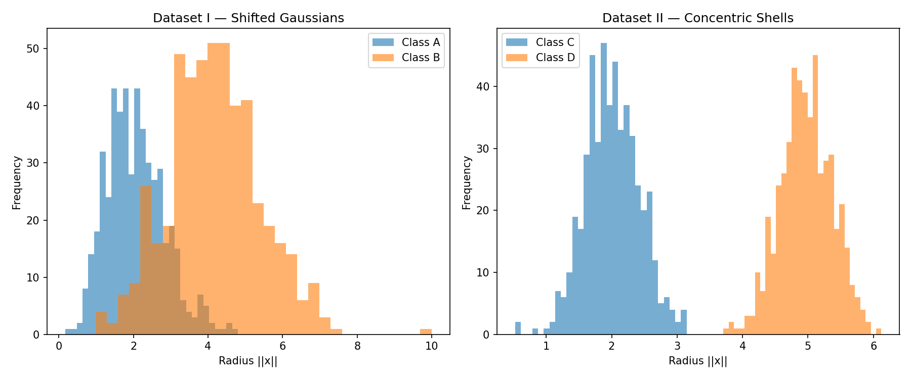

# 1. Data

!!! abstract "Enunciado"

    [Exercises → Data](https://insper.github.io/ann-dl/){:target='_blank'}

---

## Exercise 1

Quatro nuvens gaussianas bidimensionais, geradas com médias e desvios-padrão diferentes,
servem para medir **quão separáveis** essas classes são — primeiro na configuração original
(item A) e depois sob diferentes fatores de dispersão (item B).

Cada classe contribui com **100 pontos** — 400 no total — amostrados de uma normal
bivariada com os parâmetros abaixo. Todas as amostragens partem do mesmo gerador,
`np.random.default_rng(42)`, o que torna os números deste relatório reprodutíveis.

| Classe | $\mu$ | $\sigma$ | Característica |
|:---:|:---:|:---:|---|
| **0** | `[2.0, 3.0]` | `[0.8, 2.5]` | estreita em $x_1$, muito alongada em $x_2$ |
| **1** | `[5.0, 6.0]` | `[1.2, 1.9]` | a mais dispersa nas duas direções |
| **2** | `[8.0, 1.0]` | `[0.9, 0.9]` | isotrópica e compacta |
| **3** | `[15.0, 4.0]` | `[0.5, 2.0]` | afastada das demais em $x_1$ |


### Código

Um único script gera os dados e todas as figuras dos itens A e B:
[`code/exercise1_point_clouds.py`](https://github.com/Iamiran1/ann-dl/blob/main/docs/exercises/data/code/exercise1_point_clouds.py).

??? example "Ver o código completo"

    ```{ .python .copy .select linenums='1' title="docs/exercises/data/code/exercise1_point_clouds.py" }
    --8<-- "docs/exercises/data/code/exercise1_point_clouds.py"
    ```

### A — Generate the clouds

#### Abordagem

Cada classe é amostrada de uma normal bivariada com as médias e desvios-padrão da tabela
acima, 100 pontos por classe. Os desvios são multiplicados por um fator `scale`, fixado em
`1.0` neste item, e o gerador `np.random.default_rng(42)` é criado uma única vez no módulo,
de modo que a mesma sequência de números é reproduzida a cada execução do script.

#### Resultado



/// caption
**Figura 1** — Distribuição das quatro classes no plano $(x_1, x_2)$ com `scale = 1.0`.
O marcador **✕** indica o centro $\mu$ de cada classe.
///

A classe 3 fica isolada à direita ($\mu_1 = 15$) e é visualmente separável das demais por uma
reta. As classes 0 e 1 se sobrepõem: seus centros distam 4.24 unidades, mas o desvio vertical
da classe 0 ($\sigma_2 = 2.5$) é da mesma ordem dessa distância.

### B — More or less spread out

#### Abordagem

Os mesmos quatro centros foram reutilizados, variando apenas a dispersão pelos fatores
`scale ∈ {0.5, 1.0, 2.0, 4.0}` — as médias permanecem fixas, então qualquer mudança na
sobreposição vem só do alargamento das gaussianas. Duas métricas foram calculadas:

- **Separation ratio** — razão entre a distância dos centros e a soma dos desvios médios:

    $$
    r_{ij} = \frac{\lVert \mu_i - \mu_j \rVert}
                  {\bar{\sigma}_i + \bar{\sigma}_j}
    $$

    Como o numerador não depende de $s$ e o denominador é proporcional a $s$, vale
    $r_{ij}(s) = r_{ij}(1)/s$ — a separação cai com o inverso da escala.

- **Taxa de mistura** — fração de pontos cujo centro mais próximo não é o da própria classe,
  isto é, o erro de um classificador de distância mínima aos centros verdadeiros.

#### Resultado



/// caption
**Figura 2** — As mesmas quatro classes para `scale = 0.5`, `1.0`, `2.0` e `4.0`,
com eixos compartilhados para permitir comparação direta.
///


=== "Separation ratio"

    | Par de classes | $s=0.5$ | $s=1.0$ | $s=2.0$ | $s=4.0$ |
    |---|---:|---:|---:|---:|
    | 0–1 | 2.652 | **1.326** | **0.663** | **0.331** |
    | 0–2 | 4.960 | 2.480 | 1.240 | 0.620 |
    | 0–3 | 8.992 | 4.496 | 2.248 | 1.124 |
    | 1–2 | 4.760 | 2.380 | 1.190 | 0.595 |
    | 1–3 | 7.284 | 3.642 | 1.821 | 0.911 |
    | 2–3 | 7.084 | 3.542 | 1.771 | 0.886 |

    Em negrito, o **par mais crítico** em cada escala. O par 0–1 é sempre o menor, e é o
    primeiro a cruzar $r_{ij} < 1$ (centros mais próximos que a soma das dispersões),
    o que acontece já em `scale = 2.0`.

=== "Taxa de mistura"

    | `scale` | Taxa de mistura | Pontos mal atribuídos |
    |---:|---:|---:|
    | 0.5 | 0.0 % | 0 / 400 |
    | 1.0 | 5.0 % | 20 / 400 |
    | 2.0 | 19.25 % | 77 / 400 |
    | 4.0 | 48.25 % | 193 / 400 |

    

    /// caption
    **Figura 3** — Taxa de mistura em função do fator de escala $s$.
    ///


### C — Overlap and decision boundaries

#### Pergunta 1
Descreva a sobreposição das quatro classes no dataset original. Uma única fronteira linear conseguiria separar todas as classes? E um conjunto de fronteiras lineares?


#### Resposta 1
No dataset original, as quatro classes formam grupos relativamente distintos. Não seria possível utilizar uma única fronteira linear para separar todas as classes. No entanto, um conjunto de fronteiras lineares poderia dividir o espaço em diferentes regiões, permitindo uma melhor separação entre as quatro classes.

---
#### Pergunta 2
Desenhe sobre a Figura 1 as possíveis fronteiras de decisão que uma rede neural treinada aprenderia para separar as classes.


#### Resposta 2


/// caption
**Figura 4** — Esboço das fronteiras de decisão sobre as nuvens da Figura 1.
///


#### Pergunta 3
Compare o desenho das fronteiras com o item B: quando as classes ficam mais dispersas, como muda a região em que a rede inevitavelmente irá errar?


#### Resposta 3
À medida que o scale aumenta, as classes se tornam mais dispersas e as regiões de sobreposição entre elas crescem. Com isso, a delimitação por fronteiras de decisão se torna mais difícil, pois amostras de classes diferentes passam a ocupar regiões próximas ou coincidentes. Esse comportamento está diretamente relacionado ao mixing rate: quanto maior a escala, maior tende a ser a taxa de mistura entre as classes e, consequentemente, maior a região em que a rede inevitavelmente cometerá erros.

---
## Exercise 2

Dois problemas de classificação em **5 dimensões**, com estruturas geométricas opostas,
servem para separar duas perguntas que o Exercise 1 mantinha juntas: **quão longe estão as
classes** e **de que forma elas se distinguem**. Cada dataset tem duas classes com
**500 amostras** cada — 1000 pontos no total — e cada amostra é um vetor

$$
x = [x_1, x_2, x_3, x_4, x_5].
$$

| Dataset | Classes | Estrutura | O que distingue as classes |
|:---:|:---:|---|---|
| **I** | A / B | duas gaussianas deslocadas, com covariâncias diferentes | deslocamento entre os centros |
| **II** | C / D | duas cascas esféricas concêntricas | distância radial até a origem |

A semente é fixada com `np.random.seed(42)` antes da primeira amostragem, de modo que todos
os números abaixo são reprodutíveis.

### Código

Um único script gera os dois datasets, aplica PCA e produz as figuras dos itens A, B e C:
[`code/exercise2-non_linearity_in_higher_dimensions.py`](https://github.com/Iamiran1/ann-dl/blob/main/docs/exercises/data/code/exercise2-non_linearity_in_higher_dimensions.py).

??? example "Ver o código completo"

    ```{ .python .copy .select linenums='1' title="docs/exercises/data/code/exercise2-non_linearity_in_higher_dimensions.py" }
    --8<-- "docs/exercises/data/code/exercise2-non_linearity_in_higher_dimensions.py"
    ```

### A — Dataset I: shifted Gaussians

#### Abordagem

As classes **A** e **B** são amostradas de normais multivariadas em 5D com
`np.random.multivariate_normal`, 500 pontos cada — uma matriz `(500, 5)` por classe.

Para a **classe A**:

$$
\mu_A = [0, 0, 0, 0, 0]
$$

$$
\Sigma_A =
\begin{bmatrix}
1.0 & 0.8 & 0.1 & 0.0 & 0.0 \\
0.8 & 1.0 & 0.3 & 0.0 & 0.0 \\
0.1 & 0.3 & 1.0 & 0.5 & 0.0 \\
0.0 & 0.0 & 0.5 & 1.0 & 0.2 \\
0.0 & 0.0 & 0.0 & 0.2 & 1.0
\end{bmatrix}
$$

Para a **classe B**:

$$
\mu_B = [1.5, 1.5, 1.5, 1.5, 1.5]
$$

$$
\Sigma_B =
\begin{bmatrix}
1.5 & -0.7 & 0.2 & 0.0 & 0.0 \\
-0.7 & 1.5 & 0.4 & 0.0 & 0.0 \\
0.2 & 0.4 & 1.5 & 0.6 & 0.0 \\
0.0 & 0.0 & 0.6 & 1.5 & 0.3 \\
0.0 & 0.0 & 0.0 & 0.3 & 1.5
\end{bmatrix}
$$

As duas classes não diferem apenas pela média. A classe B tem variâncias maiores (1.5 contra
1.0 na diagonal) e, sobretudo, uma **estrutura de correlação diferente**: as duas primeiras
dimensões são positivamente correlacionadas em A ($\Sigma_{12} = 0.8$) e negativamente
correlacionadas em B ($\Sigma_{12} = -0.7$). 
#### Resultado

A distância entre os centros empíricos das duas classes é

$$
\lVert \bar{x}_A - \bar{x}_B \rVert = 3.390,
$$

próxima do valor teórico $\lVert \mu_A - \mu_B \rVert = 1.5\sqrt{5} \approx 3.354$. Como o
desvio-padrão por dimensão é da ordem de 1.0–1.22, os centros estão a cerca de três desvios
um do outro: há sobreposição, mas o deslocamento domina.

### B — Dataset II: concentric shells

#### Abordagem

O segundo dataset também tem 500 amostras por classe em 5D, mas é construído em coordenadas
radiais. Para cada amostra, sorteia-se primeiro uma **direção** — um vetor gaussiano
normalizado:

$$
v \sim \mathcal{N}(0, I_5),
\qquad
u = \frac{v}{\lVert v \rVert}
\quad \Longrightarrow \quad
\lVert u \rVert = 1.
$$

Como $\mathcal{N}(0, I_5)$ é isotrópica, $u$ é uniforme sobre a esfera unitária: carrega
apenas direção, nenhuma informação de escala. Em seguida cada classe recebe um **raio** de
uma distribuição própria, e o ponto final é $x = \rho\,u$:

| Classe | Raio $\rho$ | Interpretação |
|:---:|:---:|---|
| **C** (*core*) | $\rho_C \sim \mathcal{N}(2.0,\ 0.4)$ | casca interna, a $\approx 2$ da origem |
| **D** (*shell*) | $\rho_D \sim \mathcal{N}(5.0,\ 0.4)$ | casca externa, a $\approx 5$ da origem |

#### Resultado

Diferentemente do Dataset I, o que separa C e D **não é um deslocamento entre centros**. Os
raios médios amostrados são 2.013 e 4.970, mas as direções são uniformes nos dois casos, de
modo que ambas as classes têm o centro praticamente na origem:

$$
\lVert \bar{x}_C - \bar{x}_D \rVert = 0.199.
$$

Esse número é o ponto central do exercício. Comparado aos 3.390 do Dataset I, ele sugeriria
classes quase coincidentes — e ainda assim C e D são **perfeitamente separáveis**, porque a
informação discriminante está inteiramente em $\lVert x \rVert$, não na posição do centro.
Distância entre centros é uma métrica que só faz sentido para estruturas do tipo do
Dataset I.

### C — Visualize and compare

#### Abordagem

Com cinco dimensões não é possível visualizar o espaço original diretamente. Para comparar os
dois datasets, cada um foi projetado de 5D para 2D com **PCA**, ajustado de forma
independente em cada dataset:

```python
pca_AB = PCA(n_components=2)
X_AB_2D = pca_AB.fit_transform(X_AB)

pca_CD = PCA(n_components=2)
X_CD_2D = pca_CD.fit_transform(X_CD)
```

Cada ponto $[x_1, x_2, x_3, x_4, x_5]$ passa a ser representado por $[PC_1, PC_2]$.

#### Resultado



/// caption
**Figura 5** — Projeção dos datasets I e II sobre as duas primeiras componentes principais.
///

No **Dataset I**, A e B se deslocam visivelmente ao longo de $PC_1$. Há sobreposição, mas a
projeção preserva a maior parte da diferença entre os grupos — uma reta em 2D já classifica
razoavelmente bem.

No **Dataset II**, a projeção destrói a estrutura: as duas cascas viram duas nuvens
concêntricas mal distinguíveis, com C no miolo e D espalhada ao redor. Uma casca esférica em
5D projetada em um plano vira um **disco cheio**, não um anel — todos os pontos cuja direção
é quase ortogonal ao plano do PCA caem perto do centro da projeção. A separação existe no
espaço original, mas não sobrevive a esta projeção linear.

##### Explained variance

A razão de variância explicada mede quanto da variabilidade das cinco dimensões originais
cada componente preserva:

| Dataset | $PC_1$ | $PC_2$ | $PC_1 + PC_2$ |
|---|---:|---:|---:|
| **I** — A/B | 52.07 % | 15.85 % | **67.91 %** |
| **II** — C/D | 22.14 % | 20.48 % | **42.63 %** |

A diferença vem da geometria. No Dataset I o deslocamento entre as classes acontece na
direção $[1,1,1,1,1]$, que é uma **única** direção do espaço — o PCA a encontra e a coloca em
$PC_1$, que sozinha responde por mais de metade da variância. No Dataset II não existe
direção privilegiada: por construção, as cascas são isotrópicas, então a variância se
distribui quase igualmente pelas cinco dimensões ($\approx 20\%$ em cada) e duas componentes
nunca poderiam capturar muito mais do que os 40 % observados.


##### A feature certa resolve o Dataset II

Para confirmar que a informação não se perdeu — apenas ficou invisível ao PCA — basta olhar
para o histograma de $\lVert x \rVert$:



/// caption
**Figura 6** — Distribuição do raio $\lVert x \rVert$ em cada classe dos dois datasets.
///

No Dataset II as duas faixas de raio nem se tocam: a classe C vai de 0.525 a **3.146** e a
classe D, de **3.707** a 6.121 — uma folga de 0.561 entre elas. No Dataset I, ao contrário,
os raios se sobrepõem bastante (médias 2.06 e 4.17), porque ali o raio não é a característica
relevante.

#### Pergunta 1

No Dataset II, a distância entre os centros das classes é próxima de zero, mas os histogramas
dos raios são bem separados. O que essa combinação indica sobre a possibilidade de separar as
classes usando um hiperplano?

#### Resposta 1

Como os centros das duas classes estão praticamente no mesmo ponto ($0.199$ de distância), a
separação não vem de um deslocamento no espaço — não existe direção ao longo da qual as
classes estejam de lados opostos. O que os separa é a distância à origem, e os histogramas
mostram que essa separação é limpa: as classes ocupam faixas radiais disjuntas.

Um único hiperplano não dá conta dessa combinação. Ele divide o espaço em dois semiespaços,
mas o Dataset II tem estrutura **concêntrica** — uma classe no miolo e a outra em volta, em
todas as direções. Qualquer hiperplano que se tente traçar corta as duas cascas ao mesmo
tempo, deixando pontos de C e de D dos dois lados.

---

#### Pergunta 2

Explique por que a estrutura do Dataset II não pode ser separada por uma fronteira linear,
independentemente da quantidade de dados coletados.

#### Resposta 2

Uma fronteira linear não consegue separar corretamente duas classes com estrutura concêntrica, pois ela apenas divide o espaço em dois lados. No Dataset II, uma classe ocupa uma região mais interna e a outra forma uma região externa ao seu redor, o que exige uma fronteira não linear. Esse problema não depende da quantidade de amostras disponíveis, mas da própria geometria das classes; portanto, mesmo com mais dados, uma fronteira linear continuaria incapaz de separá-las completamente.

---

#### Pergunta 3

O PCA é uma transformação linear. Uma projeção em 2D na qual as classes parecem misturadas
prova que elas são inseparáveis no espaço original? Justifique com os seus próprios
resultados e escreva uma função simples das entradas que consiga separar o Dataset II.

#### Resposta 3

Não. O fato de as classes parecerem misturadas após o PCA não prova que sejam inseparáveis no espaço original, pois a projeção pode descartar informações relevantes. No Dataset II, a separação é melhor observada pelo raio dos pontos. Uma regra simples como classificar pontos com \(\|x\| < 3.5\) como classe C e os demais como classe D consegue separar bem as duas classes.

---
## Results summary

Esta tabela não substitui nenhuma análise — é um índice dos números já calculados, reunidos
em um só lugar para que a correção confira cada valor sem ter que procurá-lo no texto.

!!! note "Preenchimento parcial"

    As linhas 1–5 vêm do Exercise 1 e as linhas 6–9, do Exercise 2. As linhas 10–13 serão
    preenchidas com o Exercise 3.

| # | Item | Your value |
|---|------|------------|
| 1 | Mixing rate at $s = 0.5$ | 0.0 % (0/400) |
| 2 | Mixing rate at $s = 1$ | 5.0 % (20/400) |
| 3 | Mixing rate at $s = 2$ | 19.25 % (77/400) |
| 4 | Mixing rate at $s = 4$ | 48.25 % (193/400) |
| 5 | Smallest $r_{ij}$ at $s = 1$, and which pair | 1.326 — par 0–1 |
| 6 | Distance between centers — Dataset I | 3.390 |
| 7 | Distance between centers — Dataset II | 0.199 |
| 8 | Explained variance PC1 + PC2 — Dataset I | 67.91 % |
| 9 | Explained variance PC1 + PC2 — Dataset II | 42.63 % |
| 10 | Share of the positive class in `Transported` | |
| 11 | Mean and median of `FoodCourt` on the training set, before transforming | |
| 12 | Final shape of the training feature matrix | |
| 13 | Minimum and maximum of the training and test sets after scaling | |

## Discussão

O que foi difícil? Onde a intuição falhou? Que decisão você tomaria diferente?

## Conclusão

O que este exercício mostrou sobre a relação entre distribuição dos dados e a complexidade
da fronteira de decisão que a rede precisa aprender?
