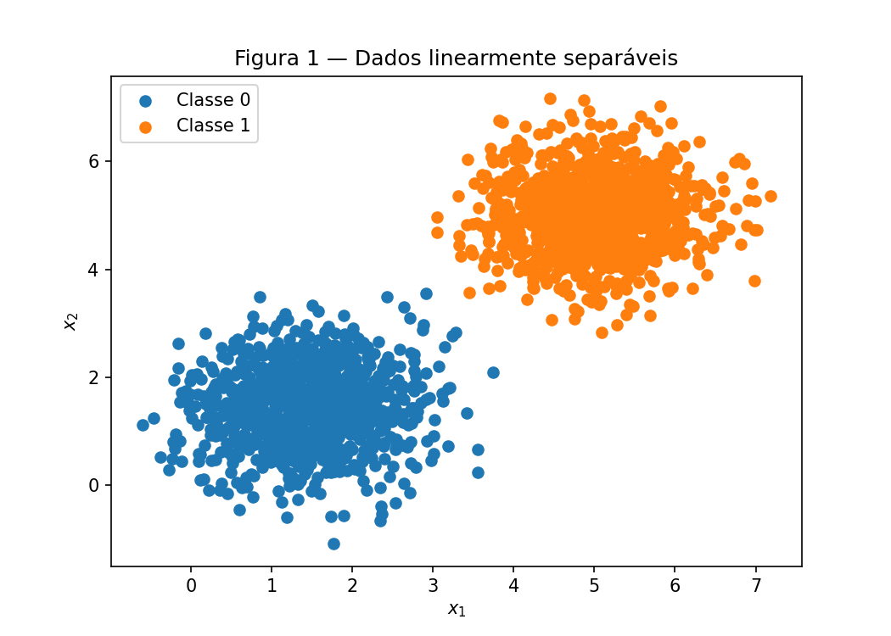
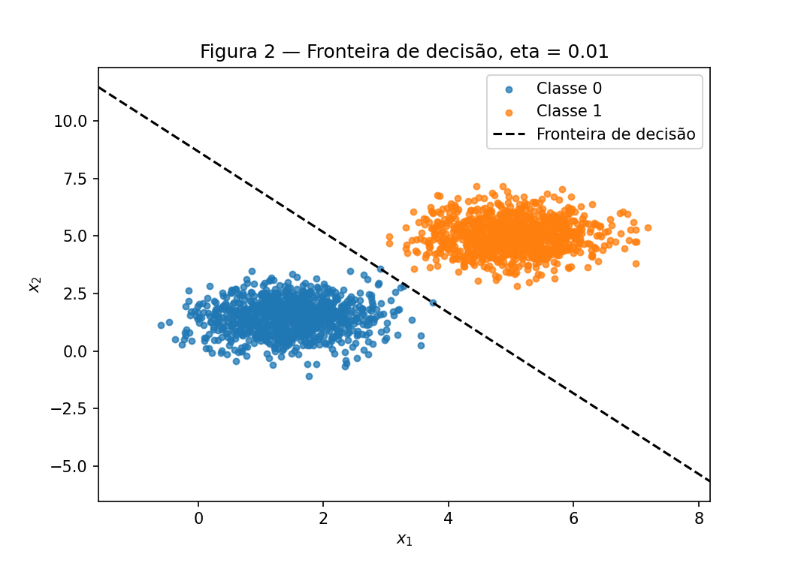
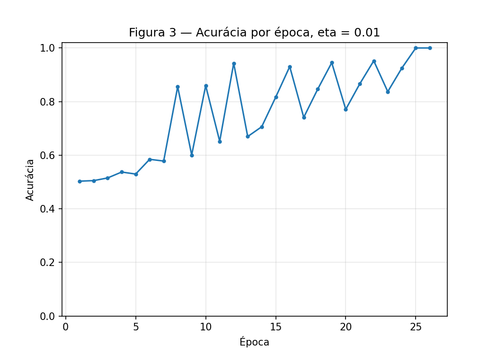
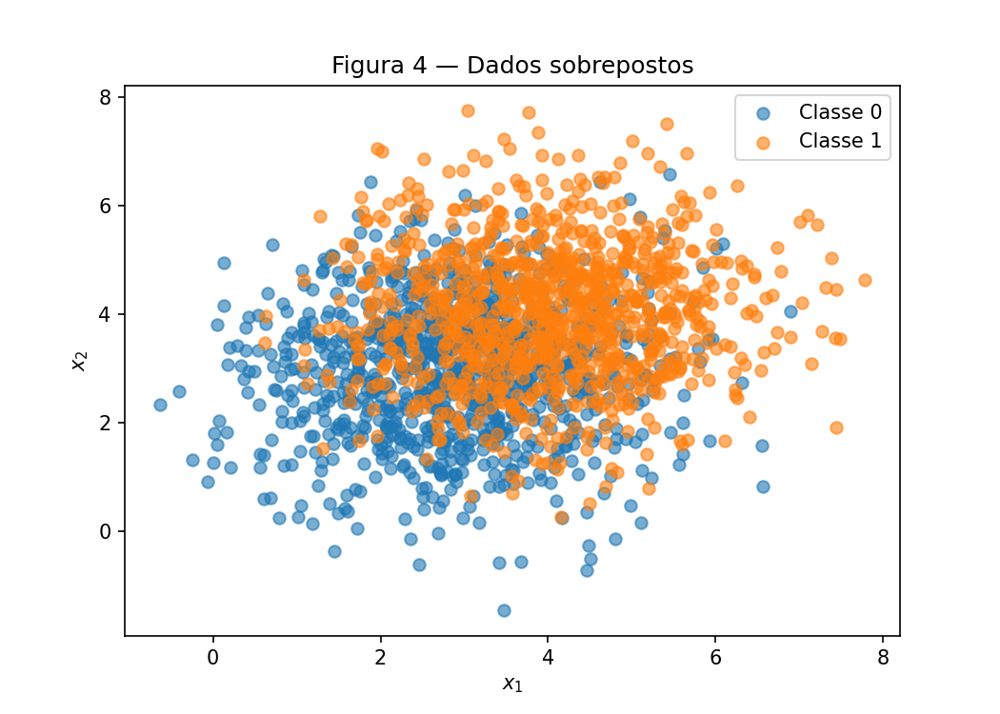
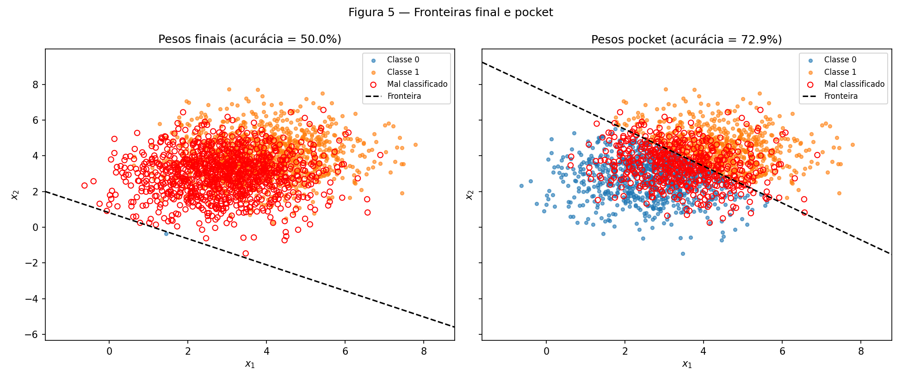
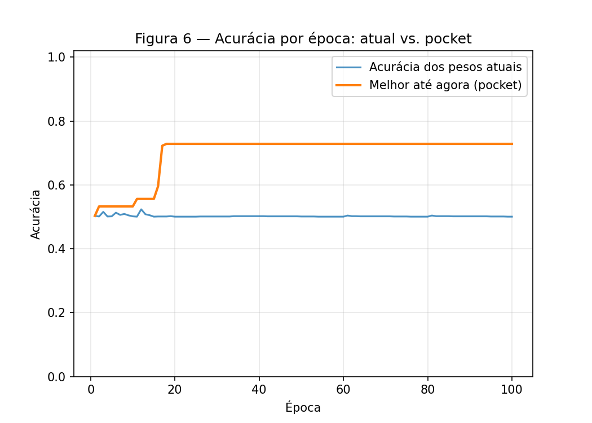

# 2. Perceptron

!!! abstract "Enunciado"

    [Exercises → Perceptron](https://insper.github.io/ann-dl/){:target='_blank'}

O fio condutor da atividade é a separabilidade: o mesmo perceptron é treinado em dois
datasets — um que o algoritmo resolve (Exercise 1), outro que ele não consegue (Exercise
2) — e o interessante não é que o segundo falhe, é *como* ele falha.

---

## Implementação reutilizada

A classe `Perceptron` abaixo é escrita uma única vez e usada, sem nenhuma alteração, nos
dois exercícios — o Exercise 2 apenas liga a flag `track_pocket` do `fit`, que é a única
adição permitida ao laço de treino.

??? example "Ver o código completo — perceptron.py"

    ```{ .python .copy .select linenums='1' title="docs/exercises/perceptron/code/perceptron.py" }
    --8<-- "docs/exercises/perceptron/code/perceptron.py"
    ```

## Exercise 1

Nuvens gaussianas bem separadas — o caso para o qual o perceptron foi desenhado.

### Código

[`code/exercise1_separable.py`](https://github.com/usuario/ann-dl/blob/main/docs/exercises/perceptron/code/exercise1_separable.py){:target='_blank'}
importa a classe acima e nunca a modifica.

??? example "Ver o código completo — exercise1_separable.py"

    ```{ .python .copy .select linenums='1' title="docs/exercises/perceptron/code/exercise1_separable.py" }
    --8<-- "docs/exercises/perceptron/code/exercise1_separable.py"
    ```

### A — Generate the data

#### Abordagem

Duas classes de 2000 pontos no total (1000 por classe), amostradas de normais bivariadas
com `rng.multivariate_normal`, a partir de um único `rng = np.random.default_rng(42)`
criado uma vez no topo do script:

| Classe | $\mu$ | $\Sigma$ |
|:---:|:---:|:---:|
| **0** | $[1.5,\ 1.5]$ | $[[0.5,\ 0],\ [0,\ 0.5]]$ |
| **1** | $[5.0,\ 5.0]$ | $[[0.5,\ 0],\ [0,\ 0.5]]$ |

Como a covariância é isotrópica ($\sigma_1=\sigma_2=\sqrt{0.5}\approx0.707$) e igual nas
duas classes, cada nuvem sai circular. A distância entre os centros é
$\lVert\mu_1-\mu_0\rVert = \sqrt{3.5^2+3.5^2}\approx4.95$ — cerca de **7 desvios-padrão**,
o que torna a sobreposição praticamente nula.

#### Resultado


/// caption
**Figura 1** — as 2000 amostras (1000 por classe); com os centros a ~7$\sigma$ de
distância, as duas nuvens não se tocam visivelmente.
///

### B — Implement the perceptron

#### Abordagem

A classe `Perceptron` (seção acima) implementa as três peças pedidas pelo enunciado:

**Predição** — $\hat{y}=\text{step}(\mathbf{w}\cdot\mathbf{x}+b)$, com
$\text{step}(z)=1$ se $z\ge0$, senão $0$.

**Regra de atualização** — para cada amostra, $\mathbf{w}\leftarrow\mathbf{w}+\eta(y-\hat{y})\mathbf{x}$,
$b\leftarrow b+\eta(y-\hat{y})$. Como $y,\hat{y}\in\{0,1\}$, o erro $(y-\hat{y})$ só
assume $0$ (acerto, sem atualização), $+1$ ou $-1$ (os dois tipos de erro). A forma
$\mathbf{w}\leftarrow\mathbf{w}+\eta\,y\,\mathbf{x}$, comum em livros-texto, pertence à
convenção de rótulos $\{-1,+1\}$: com rótulos $\{0,1\}$ ela nunca atualizaria nos pontos
da Classe 0, e o perceptron jamais corrigiria um falso positivo.

**Inicialização** — $\mathbf{w}$ sorteado de `rng.normal(0, 0.01, size=2)`, $b=0$, nunca a
partir de zero (o item D3 mostra algebricamente por quê).

**Taxa de aprendizado** — $\eta=0.01$.

**Parada** — uma época inteira sem nenhuma atualização, ou 100 épocas, o que vier
primeiro. A acurácia no dataset completo é registrada ao final de cada época.

### C — Train and measure

#### Resultado

Com `w_init = [0.002532, 0.008952]` (sorteado uma única vez e reaproveitado no item D):

| Métrica | Valor |
|---|---:|
| $\mathbf{w}$ final | $[0.050497,\ 0.028872]$ |
| $b$ final | $-0.250000$ |
| Épocas até convergir | 26 |
| Acurácia final | 100% |


/// caption
**Figura 2** — fronteira encontrada após 26 épocas. Nenhum ponto ficou mal classificado
(não há marcadores vermelhos), consistente com a acurácia final de 100%.
///


/// caption
**Figura 3** — acurácia no dataset completo, medida ao fim de cada época; a curva satura
em 100% antes da época 26 e a partir daí não há mais atualizações.
///

### D — Analysis

#### Por que os dados separáveis convergem rápido

O número de atualizações por época cai ao longo do treino: `[3, 3, 4, 4, 3, 4, 3, 4, 2,
4, 2, 4, 2, 3, 3, 3, 2, 3, 3, 2, 3, 3, 2, 3, 1, 0]` — começa oscilando entre 2 e 4 por
época e termina em `1` e depois `0`. Isso é direto da regra de atualização: cada erro
empurra $\mathbf{w}$ um pouco mais na direção da fronteira correta; com as classes a
7$\sigma$ de distância, poucos ajustes bastam para que a reta pare de cruzar qualquer
ponto, e a partir daí toda época passa inteira sem gerar erro — a condição de parada
("uma época sem atualização") é satisfeita cedo.

#### Re-treino com $\eta=1.0$

Mantendo o mesmo `w_init` e mudando só $\eta$:

| | $\eta=0.01$ | $\eta=1.0$ |
|---|---:|---:|
| Épocas | 26 | 37 |
| Acurácia final | 100% | 100% |
| $\mathbf{w}$ final | $[0.050497,\ 0.028872]$ | $[5.870616,\ 3.359239]$ |

Os dois convergem em 100%, mas o ângulo entre as duas direções finais
($\mathbf{w}/\lVert\mathbf{w}\rVert$) é de apenas **0.02°** — praticamente a mesma reta.
Isso porque $\mathbf{w}_{\text{init}}$ tem magnitude ~0.01, muito menor que o passo de
cada atualização ($\eta\lVert\mathbf{x}\rVert$, da ordem de $0.01\times3\approx0.03$ para
$\eta=0.01$) — a direção inicial é irrelevante desde a primeira atualização, e como o
problema é simétrico, os dois $\eta$s convergem para direções quase idênticas.
O que $\eta$ de fato controla é a **magnitude** de $\mathbf{w}$ (e, por consequência, a
posição exata da fronteira e o número de épocas até a primeira passada sem erro): com
$\eta$ 100× maior, cada atualização também é 100× maior, e o treino "ultrapassa" o ponto
de convergência de forma diferente a cada época, terminando numa margem ligeiramente
distinta (offset $|b|/\lVert\mathbf{w}\rVert$ de 4.30 contra 4.58) e em um número
diferente de épocas (26 contra 37).

#### A partir de $\mathbf{w}_0=\mathbf{0}$, $b_0=0$

Partindo de zero, a atualização é $\mathbf{w}\leftarrow\eta(y-\hat y)\mathbf{x}$ somada
repetidamente — depois de $k$ atualizações, $\mathbf{w}=\eta\sum_{i=1}^{k}(y_i-\hat
y_i)\mathbf{x}_i$, um fator $\eta$ multiplicando uma soma que **não depende de $\eta$**
(ela só depende de quais amostras foram classificadas erradas em cada passo — e isso
depende apenas do **sinal** de $\mathbf{w}\cdot\mathbf{x}+b$, que é invariante a reescalar
$\mathbf{w}$ e $b$ pelo mesmo fator positivo). Logo, rodar o treino inteiro com $\eta_1$ e
depois com $\eta_2$ produz exatamente a mesma sequência de acertos/erros, e os pesos
finais diferem apenas pelo fator constante $\eta_2/\eta_1$ — a fronteira
($\mathbf{w}/\lVert\mathbf{w}\rVert$ e $|b|/\lVert\mathbf{w}\rVert$, que são invariantes a
essa escala) e o número de épocas são idênticos.

A tabela confirma isso numericamente, comparando $\eta=0.01$ e $\eta=1.0$ a partir de
$\mathbf{w}_0=\mathbf{0}$:

| | $\eta=0.01$ | $\eta=1.0$ | razão |
|---|---:|---:|---:|
| Épocas | 37 | 37 | 1.0 |
| $\mathbf{w}$ final | $[0.058681,\ 0.033503]$ | $[5.868084,\ 3.350287]$ | $[100.0,\ 100.0]$ |
| $b$ final | (proporcional) | (proporcional) | $100.0$ |

A razão $\eta_2/\eta_1=1.0/0.01=100$ bate exatamente com a razão observada em cada
componente de $\mathbf{w}$ e em $b$ — e o número de épocas é idêntico. É por isso que o
item B exige inicialização não-nula: só assim $\eta$ tem algum efeito sobre a fronteira
encontrada.

---

## Exercise 2

As mesmas nuvens, agora próximas e mais espalhadas — nenhuma reta separa as classes
perfeitamente.

### Código

[`code/exercise2_overlapping.py`](https://github.com/usuario/ann-dl/blob/main/docs/exercises/perceptron/code/exercise2_overlapping.py){:target='_blank'}
reaproveita a mesma classe `Perceptron`, sem alterar nada nela — só passa
`track_pocket=True` para o `fit`.

??? example "Ver o código completo — exercise2_overlapping.py"

    ```{ .python .copy .select linenums='1' title="docs/exercises/perceptron/code/exercise2_overlapping.py" }
    --8<-- "docs/exercises/perceptron/code/exercise2_overlapping.py"
    ```

### A — Generate the data

#### Abordagem

| Classe | $\mu$ | $\Sigma$ |
|:---:|:---:|:---:|
| **0** | $[3.0,\ 3.0]$ | $[[1.5,\ 0],\ [0,\ 1.5]]$ |
| **1** | $[4.0,\ 4.0]$ | $[[1.5,\ 0],\ [0,\ 1.5]]$ |

A variância triplicou em relação ao Exercise 1 (0.5 → 1.5, $\sigma\approx1.22$) e a
distância entre centros caiu para $\sqrt{2}\approx1.41$ — menos de 1.2 desvios-padrão,
contra os ~7 do Exercise 1. As nuvens se sobrepõem fortemente.

#### Resultado


/// caption
**Figura 4** — as 2000 amostras; ao contrário da Figura 1, não há um "vazio" separando as
duas cores.
///

### B — Train, keeping the best weights

#### Abordagem

A mesma classe do Exercise 1 é reutilizada sem alteração, com `eta=0.01` e o mesmo teto de
100 épocas. Como os dados não são separáveis, o treino nunca atinge zero atualizações e
roda as 100 épocas completas. `track_pocket=True` liga o algoritmo pocket: a cada
atualização, se a acurácia no dataset inteiro com os pesos atuais superar o melhor recorde
já visto, esses pesos são copiados (`.copy()`) para um "bolso" separado.

#### Resultado

| | Pesos finais | Pesos pocket |
|---|---:|---:|
| $\mathbf{w}$ | $[0.036057,\ 0.049421]$ | $[0.006841,\ 0.006620]$ |
| $b$ | $-0.040000$ | $-0.050000$ |
| Acurácia | **50.05%** | **72.85%** |

O recorde do pocket ocorreu na **época 18**. O treino rodou as 100 épocas completas (nunca
convergiu). Como esperado pelo enunciado, a acurácia dos pesos finais fica perto de 50% —
equivalente a chutar — enquanto o pocket fica perto do limite teórico da melhor reta
possível para este problema: como as duas classes têm a mesma covariância isotrópica, a
fronteira ótima de Bayes é linear (a mediatriz do segmento entre as médias), com acurácia
teórica de **71.81%** — muito próxima dos 72.85% do pocket.

### C — Figures


/// caption
**Figura 5** — as duas fronteiras encontradas. À esquerda, os pesos finais (50.05% de
acurácia, quase metade dos pontos mal classificados); à direita, os pesos pocket (72.85%,
muito mais próxima do limite teórico).
///


/// caption
**Figura 6** — acurácia dos pesos atuais (oscilando, sem nunca estabilizar) contra o
melhor-até-agora do pocket (crescente e depois estável a partir da época 18).
///

### D — Analysis

#### O que explica a diferença entre pesos finais e pocket

A chave está em como $\mathbf{w}$ e $b$ se movem por atualização. O passo de $\mathbf{w}$
é $\eta\lVert\mathbf{x}\rVert$; com $\lVert\mathbf{x}\rVert\approx5.07$ neste dataset (bem
próximo do $\approx5$ citado no enunciado) e $\eta=0.01$, isso dá $\approx0.0507$ por
atualização. Já o passo de $b$ é sempre $\eta=0.01$, **cerca de 5× menor**, e constante —
não depende de onde o ponto está. Como os dados nunca param de gerar erros (não há reta
perfeita), $\mathbf{w}$ segue sendo empurrado repetidas vezes em direções que dependem de
quais pontos foram classificados errado por último, enquanto $b$ mal se move. O resultado:
a **direção** da fronteira final fica instável, "sacudida" a cada mistura de erros
recentes, em vez de se assentar numa boa orientação — e é por isso que a fronteira final
fica longe do centro da nuvem, cortando a região de sobreposição de um jeito ruim, com
metade dos pontos de cada lado errado ($\approx$50% de acurácia). O pocket resolve isso
não mudando a regra de atualização, só **memorizando** o melhor resultado que o treino já
visitou ao longo do caminho — que fica perto do ótimo porque, em algum momento das 100
épocas, a fronteira passou perto da mediatriz ótima.

#### Teorema de convergência

O teorema de convergência do perceptron garante que, para dados **linearmente
separáveis**, o número de atualizações necessárias até erro zero é finito (limitado por
$(R/\gamma)^2$, com $R$ o raio dos dados e $\gamma$ a margem). A Figura 3 (Exercise 1)
mostra exatamente esse comportamento: a acurácia sobe e satura em 100%. A Figura 6 nunca
satura — porque este dataset **viola a premissa de separabilidade** do teorema: não existe
$\mathbf{w},b$ que classifique tudo corretamente, então não há um "erro zero" para o
teorema garantir, e a acurácia dos pesos atuais oscila para sempre.

#### Mais épocas ou $\eta$ menor não resolvem

Nenhum dos dois ataca a causa raiz. Mais épocas apenas repetem o mesmo padrão de
atualizações — sem separabilidade, sempre existirão pontos do lado errado da fronteira
gerando novas correções, então a oscilação da Figura 6 continuaria por mais 100, 1000 ou
10000 épocas, sem nunca estabilizar (o pocket ainda ajudaria, mas o platô já é atingido
cedo — época 18 aqui — porque a melhor fronteira linear possível para estes dados já tem
acurácia limitada a ~72%, não a 100%). Um $\eta$ menor só reescala o tamanho de cada passo
igualmente para $\mathbf{w}$ e $b$ — pela mesma lógica algébrica do item D3 do Exercise 1,
reduzir $\eta$ não muda a **direção** que cada atualização empurra a fronteira, só a
velocidade; o padrão de instabilidade (que vem de os dados não serem separáveis, não da
magnitude do passo) permanece.

---

## Results summary

| # | Quantidade | Valor |
|---|---|---:|
| 1 | Exercise 1 — $\mathbf{w}$ e $b$ finais | $\mathbf{w}=[0.050497,\ 0.028872]$, $b=-0.250000$ |
| 2 | Exercise 1 — épocas até convergência | 26 |
| 3 | Exercise 1 — acurácia final | 100% |
| 4 | Exercise 1 — épocas e acurácia final com $\eta=1.0$ | 37 épocas, 100% |
| 5 | Exercise 2 — $\mathbf{w}$ e $b$ finais | $\mathbf{w}=[0.036057,\ 0.049421]$, $b=-0.040000$ |
| 6 | Exercise 2 — acurácia dos pesos finais | 50.05% |
| 7 | Exercise 2 — acurácia dos pesos pocket | 72.85% |
| 8 | Exercise 2 — época do melhor pocket | 18 |

## Discussão

O mesmo algoritmo, sem nenhuma mudança na regra de atualização ou no laço de treino,
produziu dois comportamentos completamente diferentes: convergência rápida e limpa
(Exercise 1) e oscilação permanente sem nunca estabilizar (Exercise 2). A diferença não
está no código — está inteiramente na geometria dos dados. O perceptron encontra qualquer
reta separadora quando ela existe, e não tem nenhum mecanismo para perceber ou se
recuperar quando ela não existe; ele continua tentando, indefinidamente. O pocket é um
remendo simples e eficaz para esse segundo caso: sem mudar como o modelo aprende, ele só
lembra o melhor momento que o treino já visitou.

## Conclusão

O perceptron resolve exatamente o problema para o qual foi desenhado — classes
linearmente separáveis — e falha de forma previsível e explicável quando essa premissa
não vale. Entender a regra de atualização ($\mathbf{w}\leftarrow\mathbf{w}+\eta(y-\hat
y)\mathbf{x}$) foi suficiente para prever, e depois confirmar numericamente, todos os
comportamentos observados: a convergência rápida do Exercise 1, a invariância da fronteira
a $\eta$ a partir de inicialização não-nula, o efeito puramente escalar de $\eta$ a partir
de zero, e a instabilidade permanente do Exercise 2 quando a suposição de separabilidade
do teorema de convergência é violada.
